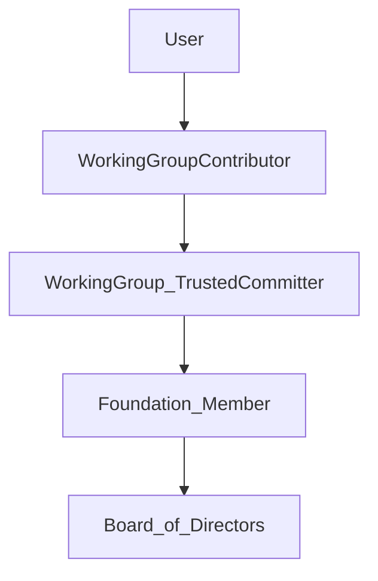

## foundation-governance

We use this public repo for all InnerSource Commons Foundation governance questions. Think of it as a place to work on the governance wireframe of the ISC foundation - use it for any questions that can safely be discussed and resolved in public without harming it.  

# What is the InnerSource Commons Foundation?

The InnerSource Commons Foundation is a neutral place for InnerSource practitioners to gather, exchange ideas and discuss challenges with like-minded peers.

Legally we are incorporated as a charitable 501(c)3 foundation in Delaware/ USA.

All nitty, gritty details can be read in the [foundation bylaws (bottom of the page)](https://innersourcecommons.org/about/board/). In short: We are a member run organisation enabling our working groups to develop educational materials on the idea of InnerSource, provide a neutral space for practitioners to connect outside of their organisations and create oportunities for these people to connect.

All of our major initiatives are driven by volunteers. Often those are collaborating across organisational and corporate boundaries. That way together we can grow beyond what any single organisation would be able to reach.

# Getting Involved

So you are interested getting involved with the InnerSource Commons. Essentially there are two ways for you to support our cause:

## Donate time

Your first step is to get in touch with the InnerSource Community. You will find most of us hanging out on the [InnerSource Commons Slack](https://innersourcecommons.slack.com/join/shared_invite/zt-277nb21f5-nnwqJU7gPWTG7KE~uGFt_w#/shared-invite/email). Look for the #general channel to introduce yourself, share your InnerSource story. We appreciate learning more on what you're doing with InnerSource. You can also join our #virtual-coffee-buddies to get you in touch 1-1 with one other community participant chosen at random from that channel. If you want to get notified of mentions of InnerSource on the web feel free to join #track_isc_google_alerts. If you have jobs to share with the community or are looking for a job there's a separate #jobs channel.

In addition look for channels related to our working groups. As of early 2024 those are the Learning Path, Patterns, and ISPO group. Channels are named accordingly: #learning-path, #innersource-patterns, #ispo-working-group. In addition each of the groups has their own GitHub repository: [Learning Path](https://github.com/InnerSourceCommons/InnerSourceLearningPath), [Patterns](https://github.com/InnerSourceCommons/InnerSourcePatterns), [ISPO](https://github.com/InnerSourceCommons/ispo-working-group).

If you want to help with outreach and marketing, feel free to join on Slack the #marketing channel.

As a general rule of thumb: There's no expectation at all that new contributors start by sending us patches. Much like in open source you are invited to join our communication channels and spend some time watching over the shoulder. After a little while you will find yourself starting to answer incoming questions, provide insights to discussions initiated. Those are already very valuable contributions! Over time you may find yourself making modifications to our existing material - this can be as small as adding your organisation to the known instances section of a pattern, or as large as creating a learning path segment that you need for rolling out InnerSource in your organisation. Chances are high that you will find others in need for that material as well - and willing to collaborate on the material together with you.

Donating time is the only way for you to become a member of the foundation and gain voting rights on new members and board members. One caveat though: All of the work shaping InnerSource happens within the working groups. The foundation exists to enable those groups and provide some shelter from whatever legal risk there may be from working in the public.

## Donate money

Alternatively you can become one of our [sponsors](https://innersourcecommons.org/about/sponsors/) supporting us financially. This way you can show very visibly with your corporate affiliation that you support the InnerSource Commons.

# Governance Structure

All our initiatives are driven by volunteers in our working groups. As a user of our materials you may find room for improvement, like adding the name of your employer to the list of known instances in an existing pattern. When doing that you become a contributor to one of our working groups.

Contributors who stick around over time are turned into Trusted Committers of the working group they are involved with. Typically Trusted Committers are also added to our GitHub organisation - both, to make interaction with their working group easier, as well as to publicly show their affiliation on their GitHub profile.

Each year in spring our members meet for the members' meeting. During that meeting existing foundation members can propose new people to become foundation members. In addition during that meeting we elect a new board of directors consisting of nine volunteers who provide oversight for the foundation.

To make sure that day to day operations run smoothly early on we decided to establish the role of Executive Director, reporting to the board of directors, typically interfacing with the chair of the board. Together with several angles providing helping hands with marketing they are our only paid roles.

